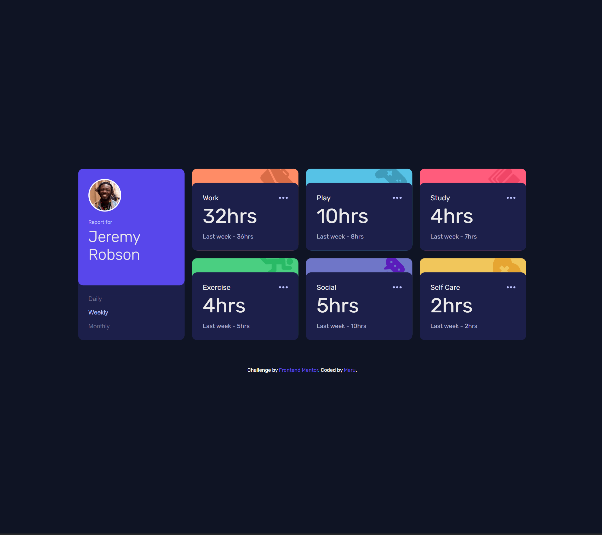
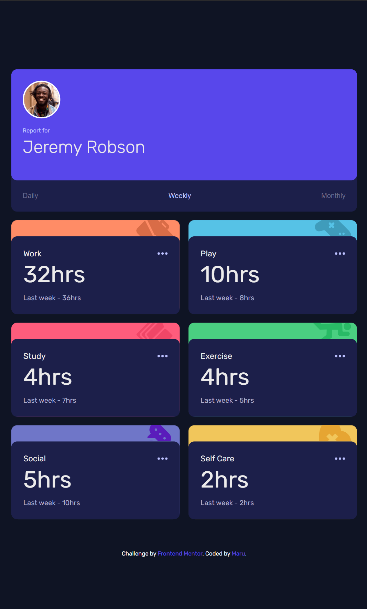
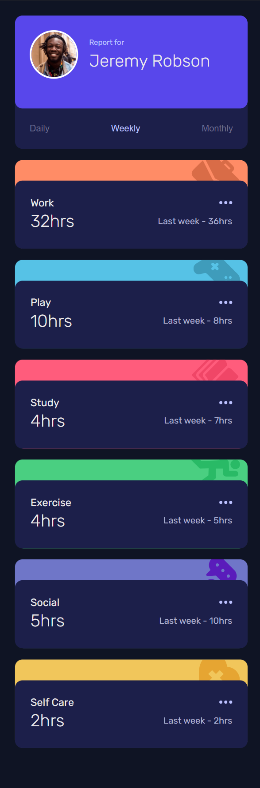

# Frontend Mentor - Time tracking dashboard solution

This is a solution to the [Time tracking dashboard challenge on Frontend Mentor](https://www.frontendmentor.io/challenges/time-tracking-dashboard-UIQ7167Jw). Frontend Mentor challenges help you improve your coding skills by building realistic projects.

## Table of contents

- [Overview](#overview)
  - [The challenge](#the-challenge)
  - [Screenshot](#screenshot)
  - [Links](#links)
- [My process](#my-process)
  - [Built with](#built-with)
  - [What I learned](#what-i-learned)
  - [Continued development](#continued-development)
- [Author](#author)

## Overview

### The challenge

Users should be able to:

- View the optimal layout for the site depending on their device's screen size
- See hover states for all interactive elements on the page
- Switch between viewing Daily, Weekly, and Monthly stats

### Screenshot







### Links

- Solution URL: [Add solution URL here](https://your-solution-url.com)
- Live Site URL: [Add live site URL here](https://your-live-site-url.com)

## My process

### Built with

- HTML5 markup
- CSS
- Flexbox
- CSS Grid

### What I learned

I practiced building responsive layouts using CSS Grid and learned how to adapt designs to different screen sizes.
I also worked with JSON data to dynamically display daily, weekly, and monthly stats, which helped me improve my JavaScript data handling skills.

```css
.container {
  max-width: 1110px;
  padding: 2rem;
  max-height: 520px;
  height: 100%;
  margin: 0 auto;
  display: grid;
  grid-template-columns: repeat(4, 1fr);
  gap: 1.5rem;
}

.profile-card {
  background: var(--navy-900);
  grid-column: 1 / 2;
  grid-row: 1 / span 2;
}

.profile-card {
  display: grid;
  grid-template-rows: auto min-content;
  border-radius: var(--border-radius);
  overflow: hidden;
}
```

```javascript
fetch("data.json")
  .then((res) => res.json())
  .then((data) => {
    cards.forEach((card, index) => {
      const title = card.querySelector(".card-type");
      const current = card.querySelector(".current-hours");
      const previous = card.querySelector(".previous-hours");

      title.textContent = data[index].title;
      current.textContent = data[index].timeframes.weekly.current + "hrs";
      previous.textContent =
        "Last week - " + data[index].timeframes.weekly.previous + "hrs";

      buttons.forEach((button) => {
        button.addEventListener("click", (e) => {
          e.preventDefault();

          const timeframe = button.dataset.timeframe;
          current.textContent =
            data[index].timeframes[timeframe].current + "hrs";
          const reduceName = timeframe.replace(/ly$/i, "");
          const goodName = reduceName.replace(/i/i, "y");

          previous.textContent =
            "Last " +
            goodName +
            " - " +
            data[index].timeframes[timeframe].previous +
            "hrs";

          buttons.forEach((btn) => {
            btn.classList.remove("active");
            button.classList.add("active");
          });
        });
      });
    });
  });
```

### Continued development

- Entrance animations for dashboard elements with staggered timing
- Hover animations for interactive elements
- Toggle between light and dark themes

## Author

- Frontend Mentor - [@zerowater](https://www.frontendmentor.io/profile/zerowater4704)
- Twitter - [@jnyngxi188584](https://www.x.com/jnyngxi188584)
